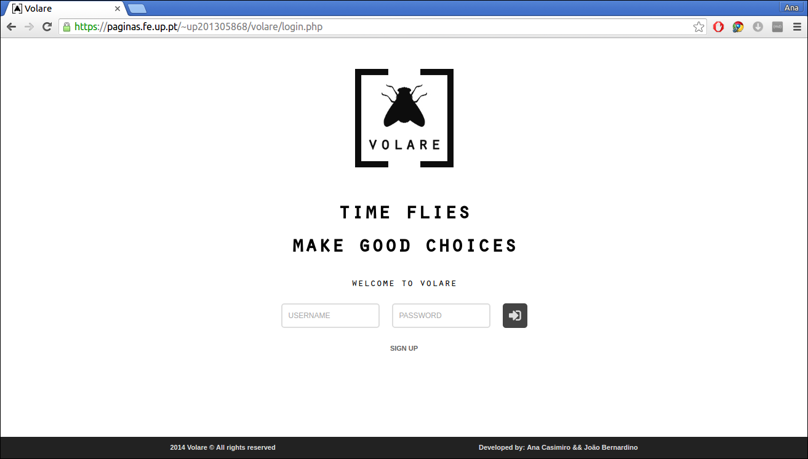

# [LTW] Volare
PHP website developed for the course LTW (FEUP). It consists of a social survey platform, where users can create and answer to polls.

## Screenshot

## Team
- Ana Casimiro ([@anacasimiro](http://github.com/anacasimiro))
- Joao Bernardino ([@joaomnb](http://github.com/joaomnb))